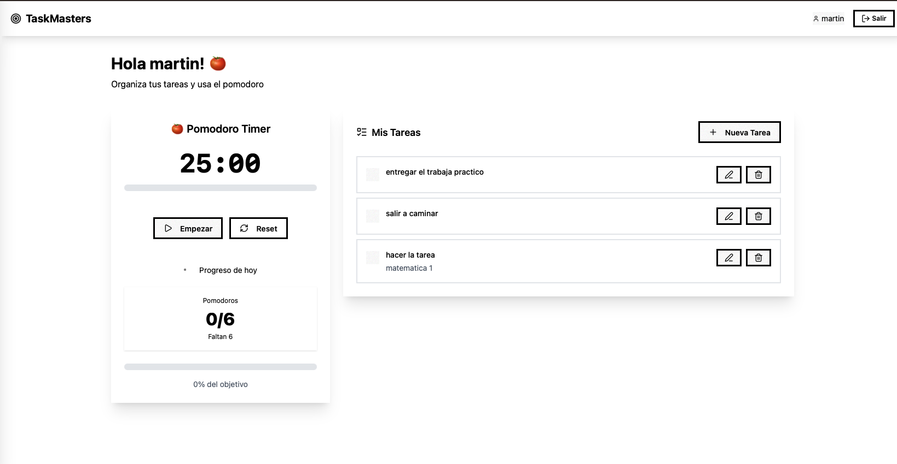
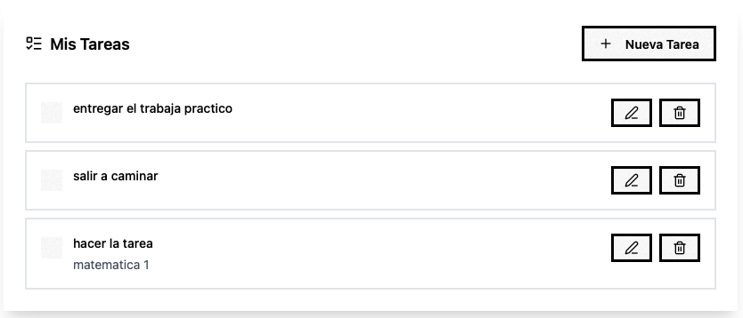
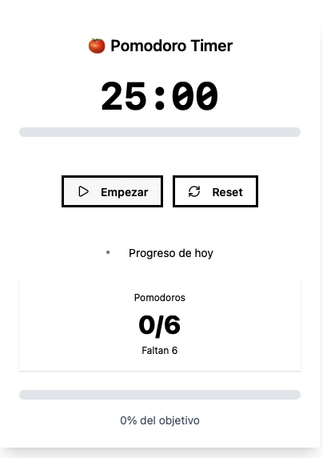
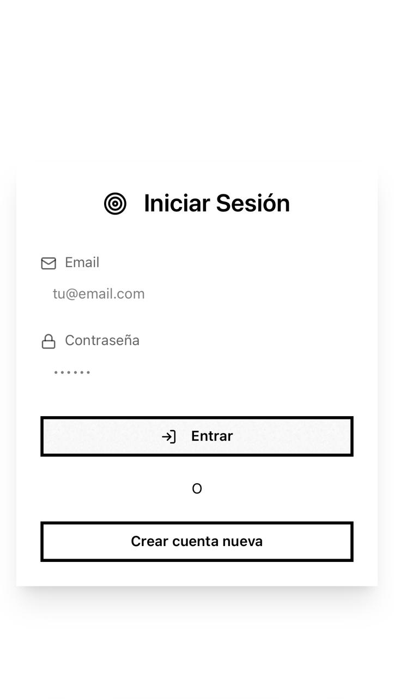

# 🍅 TaskMasters - Frontend

> Aplicación web de gestión de tareas con técnica Pomodoro desarrollada para la **Diplomatura en Desarrollo Web Full Stack** de la **UTN**.

## 📋 Descripción del Proyecto

TaskMasters es el frontend de una aplicación completa para gestionar tareas usando la técnica Pomodoro. Permite crear, organizar y completar tareas mientras trackeas tu productividad con sesiones de trabajo de 25 minutos.

## 🛠️ Tecnologías Utilizadas

### Core
- **React 19** - Librería principal para la interfaz
- **Vite** - Build tool y dev server súper rápido
- **React Router DOM** - Navegación entre páginas

### Styling & UI
- **Tailwind CSS 4** - Framework de CSS utility-first
- **DaisyUI** - Componentes pre-diseñados para Tailwind
- **Lucide React** - Iconos SVG modernos y livianos

### HTTP & Estado
- **Axios** - Cliente HTTP para conectar con la API
- **Context API** - Manejo de estado de autenticación

## 🚀 Instalación y Configuración

### Prerrequisitos
- **Node.js** v18 o superior
- **npm**
- **Backend de TaskMasters** corriendo en `http://localhost:3000`

### 1️⃣ Clonar el repositorio
```bash
git clone <URL_DEL_REPO>
cd TaskMasters/frontend
```

### 2️⃣ Instalar dependencias
```bash
npm install
```

### 3️⃣ Configurar variables de entorno
Copia el archivo de ejemplo y configura la URL de tu backend:

```bash
cp .env.example .env
```

Edita el archivo `.env` y ajusta la URL según tu entorno:

```bash
# Para desarrollo local
VITE_API_URL=http://localhost:3000

# Para producción
# VITE_API_URL=https://tu-backend-desplegado.com
```

### 4️⃣ Iniciar el servidor de desarrollo
```bash
npm run dev
```

La aplicación estará disponible en `http://localhost:5173`

## 📸 Capturas de Pantalla

### Dashboard Principal

*Vista principal de la aplicación mostrando las tareas y el timer Pomodoro integrado*

### Lista de Tareas

*Gestión completa de tareas con diferentes estados y categorías*

### Timer Pomodoro

*Temporizador Pomodoro en funcionamiento con estadísticas y controles*

### Formulario de Nueva Tarea

*Modal intuitivo para crear y editar tareas con categorías*

### Vista Mobile

*Diseño completamente responsivo optimizado para dispositivos móviles*

## 🏗️ Scripts Disponibles

### Desarrollo
```bash
npm run dev        # Inicia el servidor de desarrollo con hot reload
```

### Build
```bash
npm run build      # Genera la build de producción en /dist
npm run preview    # Preview de la build de producción
```

### Linting
```bash
npm run lint       # Ejecuta ESLint para revisar el código
```

## 🎨 Tema y Diseño

### Paleta de Colores (Tema Nord)
- **Primario**: Azul nórdico para botones y acentos
- **Secundario**: Grises suaves para texto y fondos
- **Success**: Verde para tareas completadas
- **Warning**: Amarillo para acciones de pausa
- **Error**: Rojo para eliminaciones

### Componentes UI
- **Cards**: Contenedores con shadow para cada sección
- **Buttons**: Estados hover y focus bien definidos
- **Forms**: Validación visual en tiempo real
- **Modals**: Overlays para edición sin perder contexto
- **Progress Bars**: Indicadores visuales de progreso

## 🔗 Integración con Backend

### Endpoints Utilizados

#### Autenticación
- `POST /api/auth/register` - Registro de usuarios
- `POST /api/auth/login` - Inicio de sesión
- `GET /api/auth/profile` - Perfil del usuario

#### Tareas
- `GET /api/tasks` - Obtener todas las tareas
- `POST /api/tasks` - Crear nueva tarea
- `PUT /api/tasks/:id` - Actualizar tarea
- `PATCH /api/tasks/:id/toggle` - Cambiar estado completado
- `DELETE /api/tasks/:id` - Eliminar tarea

#### Categorías
- `GET /api/categories` - Obtener categorías
- `POST /api/categories/defaults` - Crear categorías por defecto

#### Pomodoros
- `POST /api/pomodoros` - Registrar pomodoro completado
- `GET /api/pomodoros/today` - Estadísticas del día
- `PUT /api/pomodoros/goal` - Actualizar objetivo diario

## 🧪 Testing y Debugging

### Para probar localmente:
1. Asegurate que el backend esté corriendo.
2. Abrí las **DevTools** del navegador para ver los logs
3. Revisá la pestaña **Network** para ver las requests a la API
4. En **Console** podés ver los logs de debug que dejé en los servicios

### Posibles problemas:
- **CORS**: Si hay problemas de CORS, revisar la configuración del backend
- **Token expirado**: Si te desloguea solo, el JWT venció (normal)
- **404 en API**: Verificar que el backend esté corriendo y en el puerto correcto

## 🎓 Contexto Académico

### Universidad Tecnológica Nacional (UTN)
**Diplomatura**: Desarrollo Web Full Stack  
**Año**: 2025  
**Enfoque**: Aplicación completa con frontend React y backend Express

### Objetivos Cumplidos
- ✅ Componentes reutilizables y modulares  
- ✅ Integración completa con API REST
- ✅ Autenticación JWT
- ✅ Diseño responsivo mobile-first
- ✅ Manejo de estado con Context API
- ✅ UI/UX moderna

## 📊 Métricas del Proyecto

### Componentes
- **12 componentes** React funcionales
- **4 páginas** principales
- **5 servicios** de API
- **1 contexto** para manejo de estado

### Funcionalidades
- **Gestión completa** de tareas (CRUD)
- **Timer Pomodoro** con persistencia
- **Sistema de categorías** 
- **Autenticación** segura
- **Diseño responsivo** para todos los dispositivos

## 🚀 Ver el proyecto en vivo

- **Frontend**: Desplegado en Vercel/Netlify (próximamente)
- **Backend**: [https://backend-taskmasters.onrender.com](https://backend-taskmasters.onrender.com)

---
## � Contacto

Si tenés alguna pregunta sobre el proyecto o querés saber más sobre la implementación, no dudes en contactarme.

**Desarrollado con ❤️ para la UTN** 🎓
